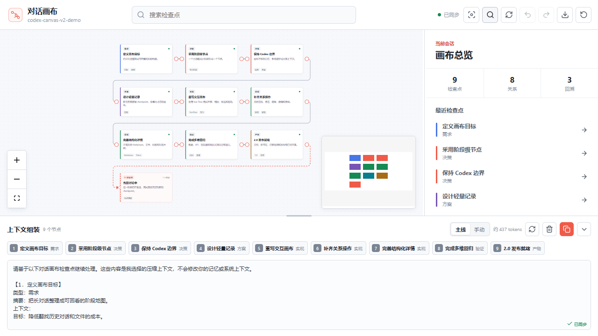

# 对话画布SKILL

对话画布SKILL 把一段 Codex 对话整理成阶段级检查点画布。节点代表小话题、决策、实现、验证或阻塞；连线表达这些阶段之间的关系，并决定底部“上下文组装”的默认顺序。

2.0 使用 Vue 3 + Vue Flow 重写画布交互，页面仍由本机 Python 服务提供，数据只保存在本机。



## 2.0 重点

- 画布支持平移、缩放、缩略图、搜索、框选、多节点拖动。
- 节点端口在悬浮时出现，可拖出新线；已有线支持删除、撤销、重做和端点重连。
- “当前讨论中”是独立节点，自动显示虚线来源，也支持多个手动来源和独立拖动。
- 右侧详情支持 Markdown、标签、相关文件和角色化对话片段。
- 底部组装区支持主线/手动模式、节点排序、草稿保留、复制和高度调整。
- 右侧详情栏可调宽；桌面、平板和手机断点会重新定位画布。
- “还原画布”只恢复布局和关系，保留全部 checkpoint，并支持撤销。
- 撤销与重做保留最近 40 步。
- schema 2 增加原子写入、跨进程文件锁、迁移备份和版本修订号。

## 产品边界

- 不修改 Codex 记忆、系统提示或内部上下文。
- 不接管 Codex 客户端输入框，也不自动发送消息。
- 连线只影响画布关系和底部组装顺序。
- 不把每句话都变成节点，只记录阶段结论。
- checkpoint 节点不可删除；位置、连线和组装顺序可以调整。

完整约束见 [产品契约](docs/PRODUCT_CONTRACT.md)。

## 安装

当前 Codex CLI 可以直接添加 GitHub marketplace：

```powershell
codex plugin marketplace add Royyyyyyyyyyyyy13/duihua-huabu-skill
```

然后在 Codex 的插件页面找到“对话画布SKILL”并安装。安装或升级 Skill 后，使用一个新任务让 Codex 读取新版规则。

本地开发目录也可以作为 marketplace：

```powershell
codex plugin marketplace add "<仓库根目录>"
```

## 使用

在 Codex 中说：

```text
使用 $codex-canvas 打开当前对话画布
```

Skill 会确定当前任务固定的 session-id，启动本地服务，并返回类似地址：

```text
http://127.0.0.1:8765/?session=<session-id>
```

端口被占用时会自动换到其他端口，以脚本实际输出为准。

### 已经聊了很久再首次启用

Codex 优先使用当前任务中已经拥有的上下文，一次性总结有意义的历史阶段，并批量写入画布。节点数量按实际内容决定，短对话可以只有一个，长对话默认最多八个。只有当前上下文不足时才使用本机记录匹配兜底。

### 从新任务开始静默记录

插件安装不会自动改写用户的 `AGENTS.md`。需要每个新任务都从第一轮轻量记录时，按 [静默模式说明](docs/SILENT_MODE.md) 添加一次全局规则。该规则直接调用 `checkpoint.py`，不会在每个新任务开始时预加载完整 Skill。

## 手动写入

```powershell
$detail = @"
## 决策
- 节点代表阶段检查点
- 连线只用于表达关系和组装顺序
"@

python ".\plugins\codex-canvas\scripts\checkpoint.py" --session demo --auto-link --type decision --title "确认边界" --summary "节点记录阶段，连线表达关系。" --detail-markdown $detail --context-text "已确认画布的产品边界。" --origin live --confidence high
```

批量 JSON、历史重建和脚本路径规则见 [Skill 说明](plugins/codex-canvas/skills/codex-canvas/SKILL.md)。

## 数据与兼容

默认 session 数据目录：

```text
~/.codex-canvas/sessions/
```

- 插件版本和数据结构版本分别管理。
- 旧 session 首次迁移到 schema 2 前会生成 `schema-*-backup-*` 备份。
- `revision` 记录所有持久化修改，`contentRevision` 单独记录节点内容变化。
- 多个 Codex 进程同时写入同一 session 时使用文件锁和原子替换，避免丢节点。
- 迁移细节见 [2.0 兼容说明](docs/2.0_MIGRATION.md)。

## 开发与验证

前端源码位于 `plugins/codex-canvas/frontend/`，构建产物位于 `plugins/codex-canvas/assets/canvas/`。

```powershell
npm --prefix .\plugins\codex-canvas\frontend ci
npm --prefix .\plugins\codex-canvas\frontend run build
npm --prefix .\plugins\codex-canvas\frontend test

$env:PYTHONUTF8='1'
$env:PYTHONDONTWRITEBYTECODE='1'
python .\plugins\codex-canvas\scripts\canvas_regression.py
```

总回归使用临时数据目录和随机端口，包含 schema 迁移、12 进程并发、历史来源防误匹配、API、安全响应头和真实浏览器交互。

## 许可证

项目使用 [MIT License](LICENSE)。第三方依赖见 [THIRD_PARTY_NOTICES.md](THIRD_PARTY_NOTICES.md)。
